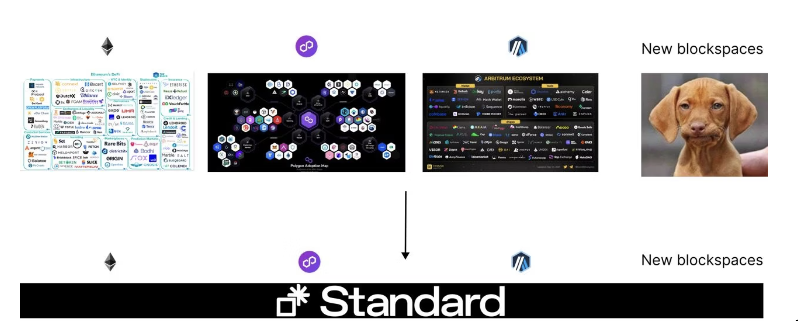

  <h1><code>Standard</code></h1>

  

    <strong>A monorepo for Standard Protocol contracts</strong>
  

  

    
    
  

## What is Standard Protocol?

Standard Protocol operates as a comprehensive, all-encompassing application designed specifically for the blockchain universe. Its primary role is to provide a foundation or starting point for newly developed blockchain spaces, ensuring they have the necessary tools and environment to establish a thriving and dynamic ecosystem. The unique aspect of Standard is its ability to function as a unified execution layer empowering its users with fully decentralized system. This unified layer is a game-changer as it bridges the gap between different blockchain systems, enabling seamless interoperability among them. In simpler terms, regardless of which blockchain you're working on or interacting with, Standard ensures they can communicate and operate with each other without complications, all on your control.

## The Standard Super App: Your Web3.0 Financial Gateway

The **Standard super app** stands as a pinnacle in the web3.0 ecosystem, bestowing individuals with a suite of integrated apps. Each app is meticulously designed to elevate diverse financial management and trading needs. Here's an insight into what each facet of Standard offers:

---

### 1. [SABT: Your Financial Steward](./contracts/sabt/README.md)

- **Core Functionality**: Acts as your self-managed account on the Standard platform.
- **Benefits**:
  - Houses credits that synergize with other apps within the platform.
  - Enables seamless transactions and financial mechanics.
  - Lets users employ credits for platform governance, actively shaping its trajectory.
  - Active subscribers can swap credits for a slice of the company's revenue, a testimony to Standard's revolutionary revenue-sharing model.

---

### 2. [SAFEX: The Digital Marketplace](./contracts/safex/README.md)

- **Core Functionality**: A fully decentralized orderbook exchange
- **Benefits**:
  - Execute trades at user-defined prices and scales.
  - Equipped with tools that cater to both novices and veterans in digital trading.
  - No slippage iwth limit order
  - Faster trade execution with market order

---

### 3. [SAFU: Monetary Standardization](./contracts/safu/README.md)

- **Core Functionality**: Grants users the liberty to adopt a preferred financial standard with stablecoin.
- **Benefits**:
  - Operates with an autonomous reserve currency system, sidestepping traditional exchange rate constraints.
  - Combines autonomous monetary blueprints with monitored capital flow for customizable financial strategizing.

---

### 4. [SAIL: Navigating Economic Currents](./contracts/sail/README.md)

- **Core Functionality**: A strategic toolset for dynamic wealth management with perpetual futures.
- **Benefits**:
  - Users can amplify or dilute their asset exposure in line with anticipated economic trends.
  - Provides actionable insights for optimal asset placement.

---

In essence, the **Standard super app** unifies **SABT** (governance & credit management), **SAFEX** (digital trading), **SAFU** (financial standardization), and **SAIL** (wealth strategy) into a cohesive ecosystem. This ensemble delivers a holistic suite of financial instruments, streamlining the intricacies of digital finance. With Standard, users are equipped, empowered, and emboldened to architect their financial destinies. It's not merely a platform but a beacon heralding the dawn of decentralized economic empowerment.

## Deployment

To deploy Standard Protocol contracts, please refer to our detailed deployment guide:

<a href="https://github.com/standardweb3/standard-2.0-contracts/blob/main/contracts/deploy.md" target="_blank" style="background-color:#3F3F3F; color: white; padding: 10px 20px; text-decoration: none; border-radius: 5px;">Go to Deployment Guide</a>

Instructions within this guide will walk you through the entire deployment process using Foundry and Forge tools. Please ensure you follow the steps meticulously to ensure successful deployment.

## Docs

For more information on the concepts and how each app works, visit the official gitbook documentation.

<a href="https://docs.standardweb3.com" target="_blank" style="background-color:#3F3F3F; color: white; padding: 10px 20px; text-decoration: none; border-radius: 5px;">Go to Official Documentation</a>

## Security

### Tests
[Contract Test Directory](./test)

### Audits
[Hacken in 2023](./audits/hacken-2023)
[Defimoon in 2023](./audits/defimoon-2023)

## Disclaimer

_These smart contracts and code are being provided as is. No guarantee, representation or warranty is being made, express or implied, as to the safety or correctness of the user interface or the smart contracts and code. There can be no assurance they will work as intended, and users may experience delays, failures, errors, omissions or loss of transmitted information. In addition, using these smart contracts and code should be conducted in accordance with applicable law. Nothing in this repo should be construed as investment advice or legal advice for any particular facts or circumstances and is not meant to replace competent counsel. It is strongly advised for you to contact a reputable attorney in your jurisdiction for any questions or concerns with respect thereto. Standard is not liable for any use of the foregoing and users should proceed with caution and use at their own risk._

## Licensing

Each project in contract folder has separate license with different dates or term. 

