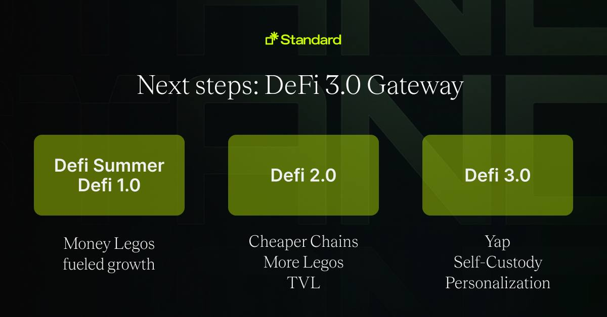
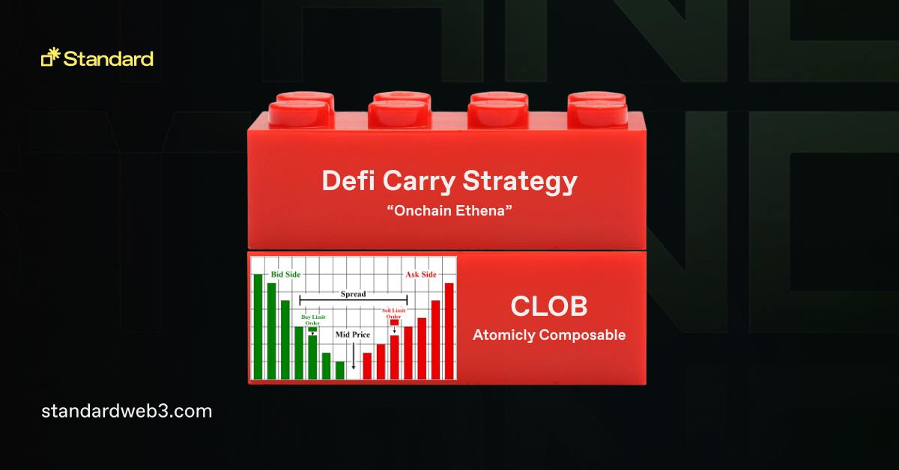

  <h1><code>Standard</code></h1>

  

    <strong>A monorepo for Standard Protocol contracts</strong>
  

  

    
  

## What is Standard Protocol?

Standard Protocol operates as a comprehensive, all-encompassing application designed specifically for the blockchains. Its primary role is to provide a foundation or starting point for newly developed blockchain spaces, ensuring they have the necessary tools and environment to establish a thriving and dynamic ecosystem. The unique aspect of Standard is its ability to function as a unified execution layer empowering its users with fully decentralized system. This unified layer is a game-changer as it bridges the gap between different blockchain systems, enabling seamless interoperability among them. In simpler terms, regardless of which blockchain you're working on or interacting with, Standard ensures they can communicate and operate with each other without complications, all on your control.

## The Standard Super App: Your DeFi3.0 Gateway

The **Standard super app** stands as a pinnacle in the DeFi 3.0 ecosystem, bestowing individuals with a suite of integrated apps. Each app is meticulously designed to elevate diverse financial management and trading needs. Here's an overview what each component of Standard offers described as money legos.

In essence, the **Standard super app** unifies **Account** (governance & incentive management), **Exchange** (fully onchain CLOB), **Stablecoin** (CDP stablecoin with delta-neutral strategy), and **Futures** (fully onchain futures) into a cohesive ecosystem. This ensemble delivers a holistic suite of financial instruments, streamlining the intricacies of digital finance. With Standard, users are equipped, empowered, and emboldened to architect their financial destinies. It's not merely a platform but a beacon heralding the dawn of decentralized economic empowerment.

## Docs

For more information on the concepts and how each app works, visit the official gitbook documentation.

<a href="https://learn.standardweb3.com" target="_blank" style="background-color:#3F3F3F; color: white; padding: 10px 20px; text-decoration: none; border-radius: 5px;">Go to Official Documentation</a>

## Security

### Unit Tests
[Contract Test Directory](./test)

### Audits
[Hacken in 2023](./audits/hacken-2023)
[Defimoon in 2023](./audits/defimoon-2023)

## Disclaimer

_These smart contracts and code are being provided as is. No guarantee, representation or warranty is being made, express or implied, as to the safety or correctness of the user interface or the smart contracts and code. There can be no assurance they will work as intended, and users may experience delays, failures, errors, omissions or loss of transmitted information. In addition, using these smart contracts and code should be conducted in accordance with applicable law. Nothing in this repo should be construed as investment advice or legal advice for any particular facts or circumstances and is not meant to replace competent counsel. It is strongly advised for you to contact a reputable attorney in your jurisdiction for any questions or concerns with respect thereto. Standard is not liable for any use of the foregoing and users should proceed with caution and use at their own risk._

## License

This software code is licensed with [BSL-1.1](./LICENSE).

Terms of some parts of the code in the monorepo have different terms.

