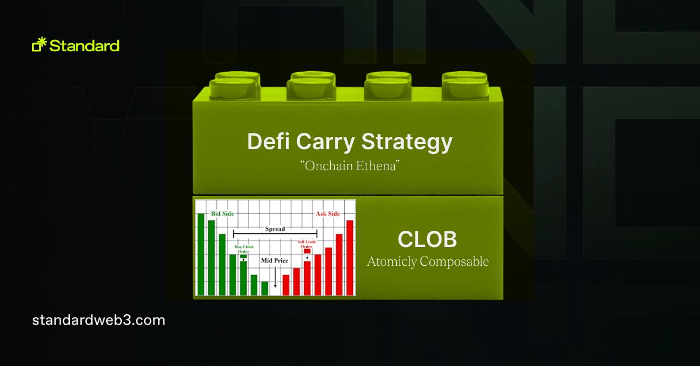

<div align="center">


  <h1><code>Standard</code></h1>

  <p>
    <strong>A monorepo of Standard contracts</strong>
  </p>

  <p>
    <a href="https://t.me/standard_protocol"></a>
  </p>
</div>

## What is Standard Protocol?


Standard Protocol is a protocol to make next-gen DeFi to solve four problems in Crypto's transparency:

**`Transparency`**: Standard's onchain CLOB provides listing mechanism where we do fair auctions to list assets officially or permissionlessly with fixed cost for making a pair.

**`Insolvency`**: All operations in Standard's CLOB are done in self-custody.

**`Security`**: By having segregation of user's funds into each account with CLOB, hackers cannot hack Standard protocol unless they hack all of user's wallet.

**`Personalization`**: By having each users' activity recorded in blockchain, personalized incentivization is possible such as fee discount, more points to top active traders in Standard orderbook exchange.

## The Standard Super App: Your DeFi3.0 Gateway


From the lessons of DeFi 2.0, Standard focuses on self-sovereignty of users asset and personalized experience. Standard declares itself as the gateway of DeFi 3.0. DeFi 2.0's failure to ensure user's safety while co-mingling assets in one contract caused losses over more than 1 billion USD worth of wealth by end users.

DeFi 2.0 also made a social hierarchy of ponzis, where regular users who are active using the app or protocol was ignored by few who had asymmetric shares in the community. While the community is formed with different individuals with different situations, DeFi 2.0 communities have always been emphasizing buying more of their coins or tokens, depositing tokens to AMM pairs to increase TVL, or boost yield by leveraging endlessly. However, people always wanted to see apps which can have their own experience.

DeFi 3.0 proposed by Standard focuses more on users' growth and experience than TVL or Token shares for the whole community. For easier and friendly experience, Standard builds fully onchain CLOB first. Other money legos always has segregation of users' fund into its protocol so that users can have safer experience than DeFi 2.0 by default. Standard makes community to willingly buy $STND token and use it for better experience instead of having higher social hierarchy in the community. Standard team is building new money legos that will deliver real, personalized user experiences.



## Money Legos

Each money lego has README to build, test, and deploy with LICENSE.

- **[`point`](src/point/)** (governance & incentive management)
- **[`exchange`](src/exchange/)** (fully onchain CLOB)
- **[`stablecoin`](src/stablecoin/)** (CDP stablecoin with delta-neutral strategy)
- **[`futures`](src/futures/)** (fully onchain futures)

## Getting Started

First, clone the repository
```
https://github.com/standardweb3/standard3.0-contracts.git
```
Then, check each money lego directory's README for further development guidance.

## Docs

For more information on the concepts and how each app works, visit the official gitbook documentation.

<a href="https://learn.standardweb3.com" target="_blank" style="background-color:#3F3F3F; color: white; padding: 10px 20px; text-decoration: none; border-radius: 5px;">Go to Official Documentation</a>

## Security

### Unit Tests

[Contract Test Directory](./test)

### Audits

[Hacken in 2023](./audits/hacken-2023)
[Defimoon in 2023](./audits/defimoon-2023)

## Disclaimer

_These smart contracts and code are being provided as is. No guarantee, representation or warranty is being made, express or implied, as to the safety or correctness of the user interface or the smart contracts and code. There can be no assurance they will work as intended, and users may experience delays, failures, errors, omissions or loss of transmitted information. In addition, using these smart contracts and code should be conducted in accordance with applicable law. Nothing in this repo should be construed as investment advice or legal advice for any particular facts or circumstances and is not meant to replace competent counsel. It is strongly advised for you to contact a reputable attorney in your jurisdiction for any questions or concerns with respect thereto. Standard is not liable for any use of the foregoing and users should proceed with caution and use at their own risk._

## License

This software code is licensed with [BSL-1.1](./LICENSE).

Terms of some parts of the code in the monorepo have different terms.
