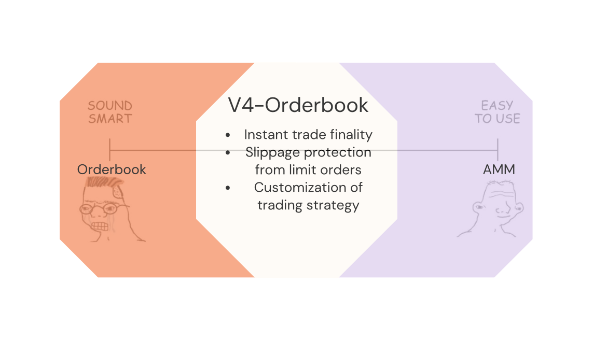
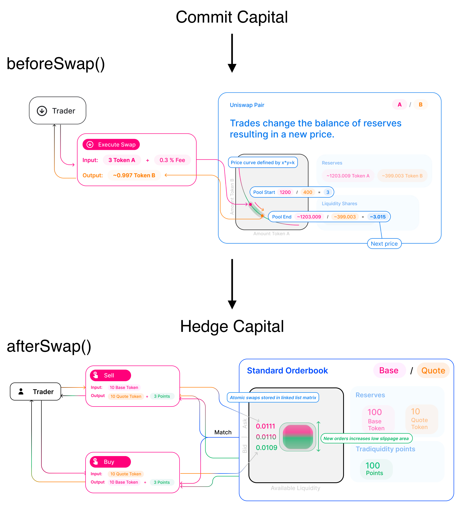

# v4-orderbook

<div align="center">

</div>

### **Ultimate on-chain trading with both AMM and orderbook working together**

> *"if ETH drops below $1500, market sell my bags"*

> *"Only sell ETH when the price goes up to $1600"*

> *"Allow slippage of 0.5% on market price, store amount which exceeds slippage threshold to limit order"*

Integrated directly into the Uniswap V4 pools, limit/market orders are posted onchain and executed via the `afterSwap()` hook. No external bots or actors are required to guarantee execution.

---

## How the hook works

<div align="center">
    
    <p><em>Hook lifecycle of v4-orderbook</em></p>
</div>

The hook has two processes to customize in trading digital assets.

1. **`Committing Capital`**: User first commits capital to trade in UniswapV4 to trade in AMM. **`beforeSwap()`** can modify amount to trade in amm for a certain tick or price by decoding it. This phase utilizes AMM to create price actions or instantly finalize trade.

2. **`Hedging Capital`**: This phase uses orderbook to hedge user's digital assets to by only traded at certain limit price. **`afterSwap()`** customizes the amount and price to hedge user's left amount after trading in AMM. if there are lower orders placed than the limit price, the hedging capital is matched. If not, it is stored at the limit price to wait for matching orders. This protects slippage or price actions from MEV attacks. 

## Use Cases

* <ins>Spot traders</ins>: protect slippage or theft by MEVs

* <ins>Leverage traders</ins>: use stop loss proceeds to repay loans. Please see [examples/README.md](examples/README.md) for usage

* <ins>Lending Protocols (advanced)</ins>: use limit/market/stop orders to *liquidate collateral* without significant price actions. Instead of liquidation bots and external participants, stop losses offer guaranteed execution
    * Note: additional safety is required to ensure that large market orders do not result in bad debt.

## Features

* **Contribute to price action, protect on price drop**: Traders now can avoid rug pull or dangerously volatile price actions by hedging a certain amount of capital in orderbook to only trade when price satisfies with their limit.

* **Safe and versatile liquidation process for decentralized lending/borrowing protocols**: lending protocols do not need to worry about price actions on AMM when liquidating assets. They can take available profit in AMM where slippage is tolerant, then protect position by storing atomic swap order in orderbook in future.

* **Customizing trading strategy**: By carefully adjusting AMM and orderbook trade amount, hook developers can make rug pull guard trading hook where it exposes certain capital to price increases on AMM, and hedge other capital to be traded at certain price to be only traded when the price keeps increasing. Good customized hooks can be sold at a hook marketplace just as trading algorithms are sold in financial market.

## Building

```shell
forge build
```

## Testing

*requires [foundry](https://book.getfoundry.sh)*

> Due to breaking changes in Uniswap v4 PoolManager, test is under development. 

```shell
# tests require a local mainnet fork
forge test --fork-url https://eth.llamarpc.com --match-test test_placeOrder
```

# Acknowledgements

this project was inspired by [v4-stoploss](https://github.com/saucepoint/v4-stoploss/tree/main), and the project was inspired by [uniswap v4 example](https://github.com/Uniswap/v4-periphery/blob/main/src/hooks/examples/LimitOrder.sol).

The difference of this project is to make the hook more scalable by implementing orderbook storage and matching engine with greedy algorithm, replacing key-value storage order without sorting or handling multiple orders. The orderbook exchange src have license of [BUSL](https://github.com/standardweb3/standard-2.0-src/blob/main/src/exchange/LICENSE).
